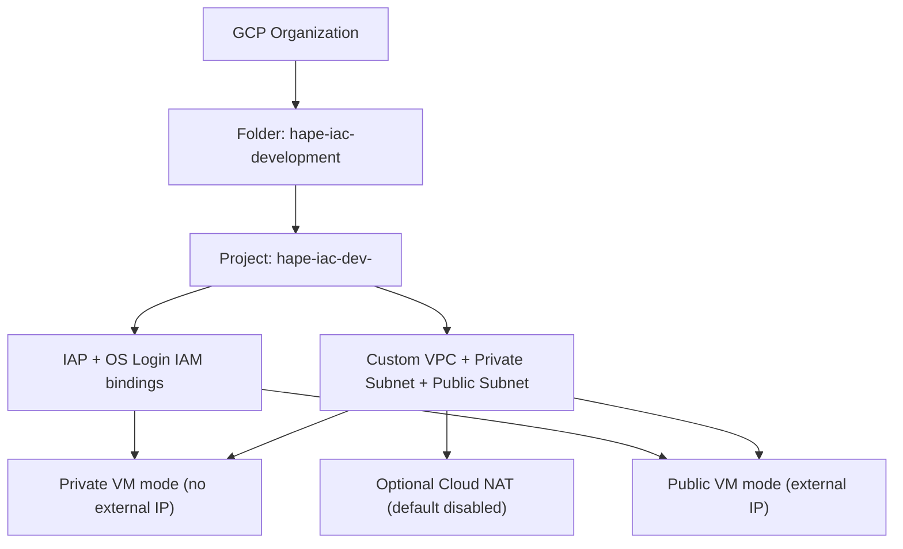

# Milestone 1 Architecture

## Goal
Provision a minimal-cost VM environment in GCP with secure administrative access and optional public-VM mode.

## Flow

## Boundaries
- One folder and one project for the learning environment.
- One development stack.
- One VM default profile (`e2-micro`) with input overrides.
- Private VM mode remains the default.
- Public VM mode is opt-in using `enable_public_ip=true` and `use_public_subnet=true`.

## Pattern Guidance Reference
- The framework golden path is the recommendation baseline for agent-generated or agent-reviewed IaC.
- Use the custom VPC and approved private and public subnet profiles instead of the GCP default network.
- Keep private VM mode as the default unless the user explicitly chooses public IP mode.
- Preserve IAP and OS Login as the VM access model.
- Treat advisory recommendations separately from deterministic Terraform and Terragrunt validation.
